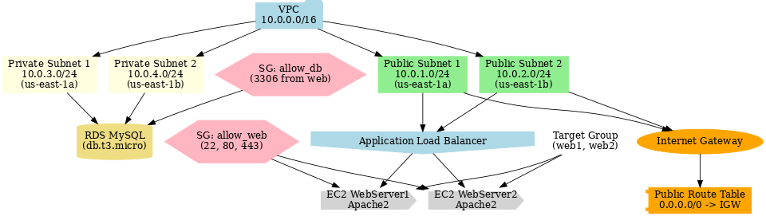

# AWS Terraform Infrastructure

This repository contains Terraform code to deploy a **highly available web application architecture** on AWS.

## 🚀 Architecture Overview

- **VPC** with CIDR `10.0.0.0/16`
- **Public Subnets**: 2 (for web servers & load balancer)
- **Private Subnets**: 2 (for RDS database)
- **Internet Gateway + Route Tables** for public access
- **Security Groups**:
  - `allow_web`: Allows SSH (22), HTTP (80), HTTPS (443)
  - `allow_db`: Allows MySQL (3306) from web security group only
- **EC2 Instances** (Apache2 web servers in public subnets)
- **Application Load Balancer** distributing traffic across EC2 instances
- **RDS MySQL** instance in private subnets (not publicly accessible)

## 🏗️ Architecture Diagram



## 🔑 Prerequisites

- AWS account
- Terraform installed (`>= 1.0`)
- Existing AWS key pair (update `key_name` variable)
- Provide values for `aws_access_key`, `aws_secret_key`, and `ami_id`


### 🚀 How to Deploy

## ⚡ Usage

```bash
git clone https://github.com/Mairazul-Khan/Terraform-Project.git


```sh
terraform init
terraform plan
terraform apply -auto-approve
```

## 🛑 Cleanup

To destroy all resources:

```sh
terraform destroy -auto-approve
```

---
📌 **Note**: Never hardcode sensitive credentials (use AWS Secrets Manager or environment variables).
